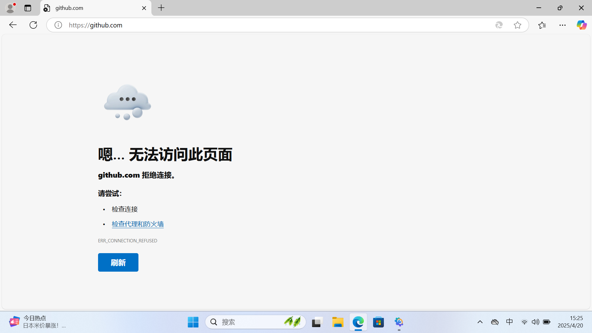
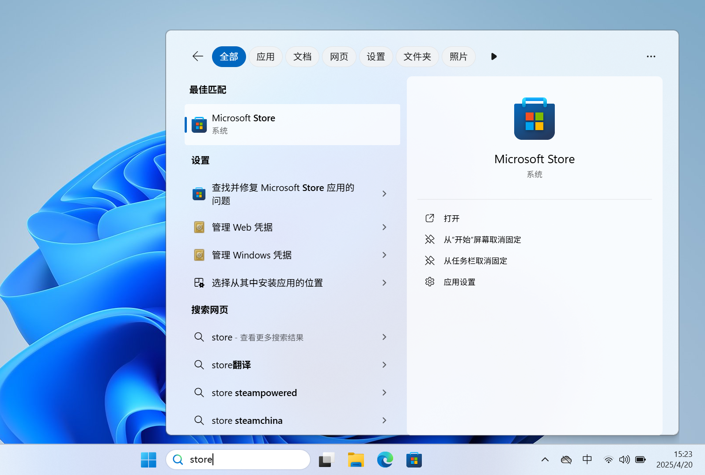
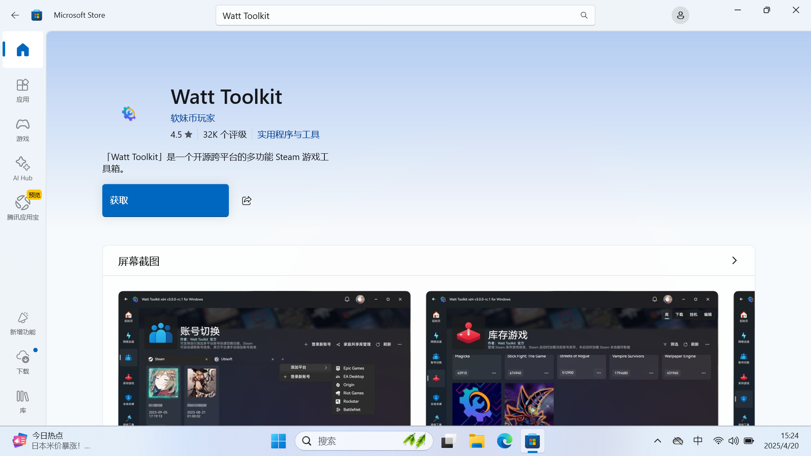
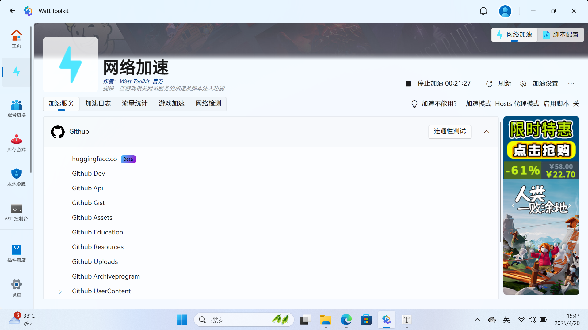

# Jason的官方网站

> 欢迎访问我的网站！ 

# 学科

## 语文

# 其他

## 1.无法上github和stream？快试试watt toolkit！

在我们使用github过程中，常常会访问不了（如下图），所以今天推荐的软件是watt toolkit。watt toolkit是一个加速器，它不仅能加速github，同时还能加速stream，对于使用这两类软件的朋友非常的友好。watt toolkit既可以在官网[点击我](https://steampp.net/)下载，也可以直接在Microsoft store里下载，这里就以Microsoft store为例

Windows：首先在搜索框中搜索Microsoft store，双击它

在Microsoft store里搜索“watt toolkit”，之后选择图中的那个，点击获取

在获取之后，点击打开，就会来到首页，我们依次点击“网络加速”-“Github”（或其他你需要加速的）-“一键加速”

之后就会来到一下界面，这就说明加速成功了

我们再次访问github，就可以发现可以进到网站上了

# 意见箱

> 在使用过程中发现任何问题，都可以到以下邮箱反馈：juncheng_sunshine@163.com
